**Ryan Ordille** (260399372)

ryan.ordille@mail.mcgill.ca

ECSE 420: Parallel Computing, Fall 2014

Lab 2 - 07 November, 2014

# Setup

## Specifications

Apple MacBook Air, 13", Mid 2011 (model 4,2)

**Operating System**: OS X 10.10 Yosemite

**Processor**: 1.7 GHz Intel Core i5, 2 cores, 256 KB L2 cache per core, 3 MB L3 cache

**Other Information**: 4 GB 1333 MHz DDR3 RAM, Intel HD Graphics 3000 384 MB, SSD drive

Using `open-mpi-1.8.3`

## Building

Execute `make` the Makefile to build and execute `mpiexec -np X ./program.out` to run, where `X` is the number of processors you wish to use. Adjust `n` in `main.c` to change the matrix size.

To print a matrix, use the `print_matrix(double**,int)` function from `tools.c/.h`.

# 1. Gaussian Elimination

## 1.1 Parallelization Strategy

## 1.2 Serial Implementation

See `GESerial.c`.

### Results

Serial implementation output:

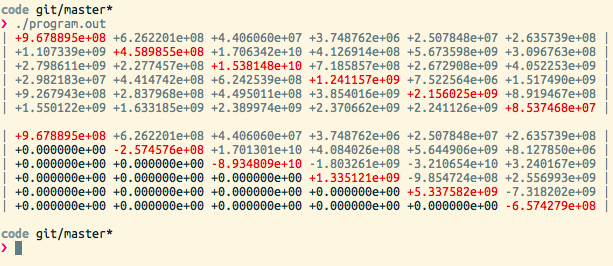

Serial implementation timing:

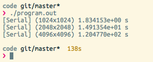

    [Serial] (1024x1024) 1.834153e+00 s
    [Serial] (2048x2048) 1.491354e+01 s
    [Serial] (4096x4096) 1.204770e+02 s

# 2. Message Passing Program

## 2.1 Point-to-Point

See `GEmpi.c`, function `gauss_elim_parallel_p2p()`.

## 2.2 Broadcast/Collective

See `GEmpi.c`, function `gauss_elim_parallel_bcast()`.

# 3. Experiment

## 3.1 Output data

Note: Some of the reported screenshot values have not been adjusted, i.e. I did not divide the total result by the number of processes. Thus for 2 processes, the reported values are twice as big as the real values, for 4 process they're 4 times the correct size, etc. I've reflected the real values in the charts where necessary.

Values in the charts are rounded to two digits or the nearest second, whichever is bigger.

Real = Total / NumProcesses

### n=1024, np=02

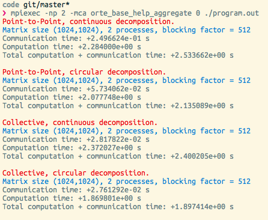

Adjusted for real time (i.e. total time / np):

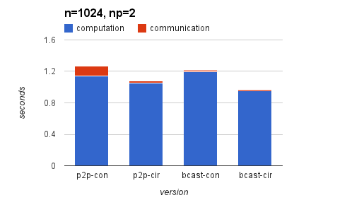

### n=1024, np=04

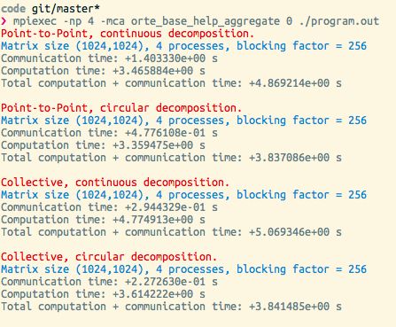

Adjusted:

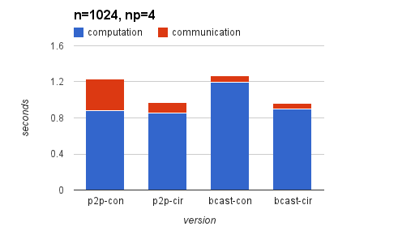

### n=1024, np=08

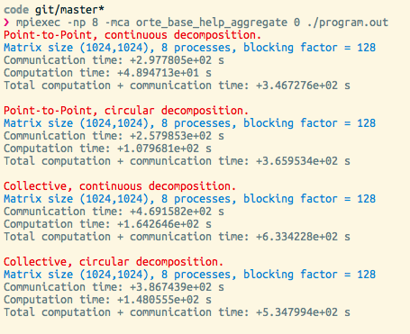

Adjusted:

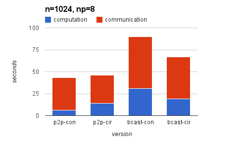

### n=1024, np=16

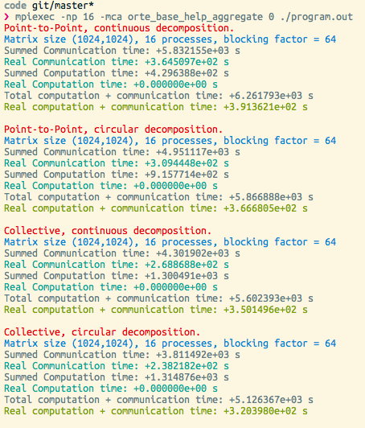

Computation times adjusted for real values:

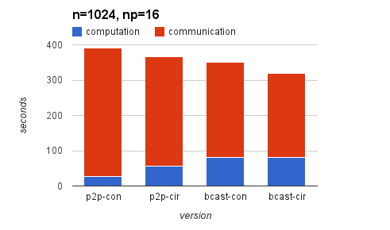

### n=2048, np=02

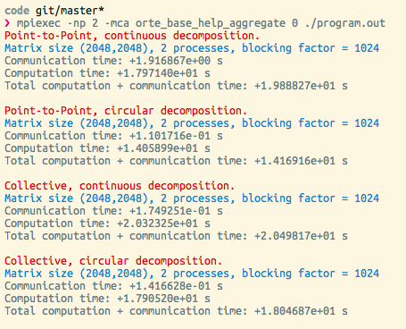

Adjusted:

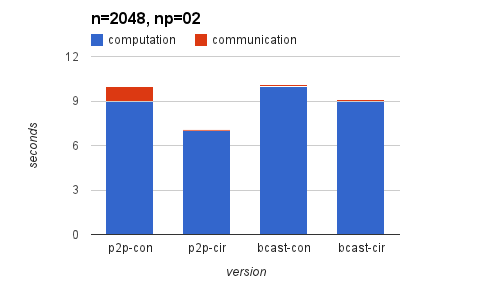

### n=2048, np=04

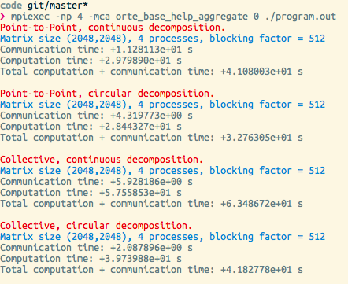

Adjusted:

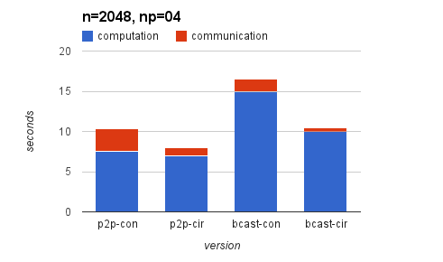

### n=2048, np=08

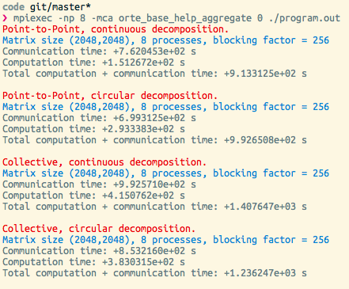

Adjusted:

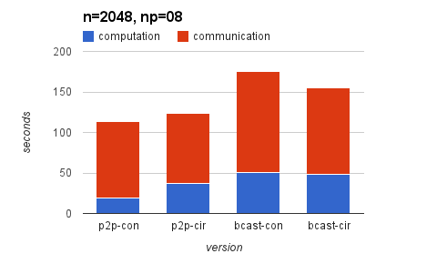

### n=2048, np=16

### n=4096, np=02

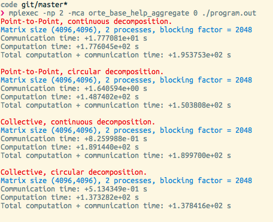

Adjusted:

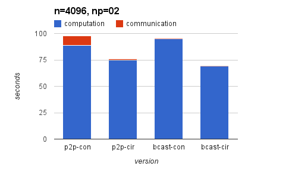

### n=4096, np=04

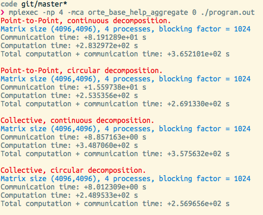

Adjusted:

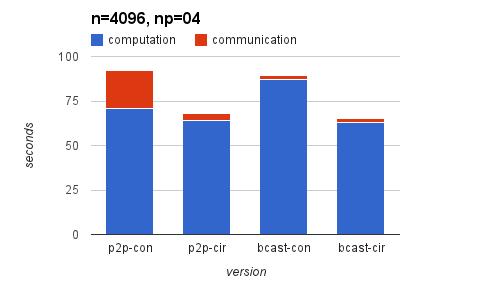

### n=4096, np=08

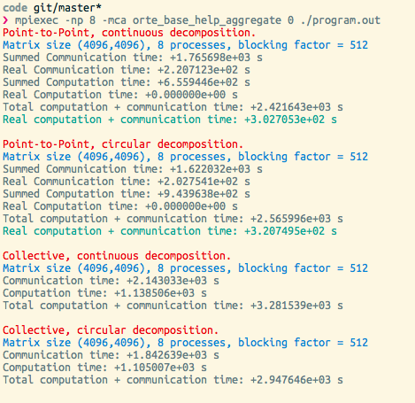

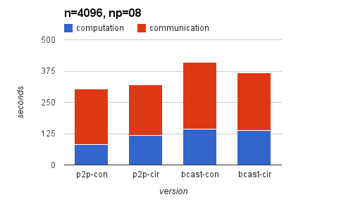

### n=4096, np=16

## 3.2 Observations

Using eight or more processes for each case lead a dramatic increase in communication overhead in every version of the parallel code. The communication overhead for 16 processes was too long for my computer to handle, using every core to 99% capacity for many minutes.

The broadcast/collective versions of the code were slightly faster than their point-to-point counterparts for less than four processes. The communication time greatly decreased, while the computation time slightly increased. I'm sure a faster processor than my own would show a greater gap between the two strategies.

With larger matrices, the broadcast method was less effective, as it has to send larger and larger buffers / local submatrices to every other process. That being said, I would suggest broadcast for all cases unless you need to dramatically reduce the amount of times a process needs to receive data (like cases with limited bandwidth).

The circular/cyclical decomposition method was noticeably faster than its continuous counterpart for four or less processes - I suspect that this is because the cyclical implementation evens out the computation load for each processor, rather than having finished processes wait after their turns are complete. I would suggest continuous over cyclical decomposition only if the system has an efficient way of caching/fetching nearby rows, or if some processors are significantly faster than others (assigning the most-used processes to these faster processors).

The continuous decomposition strategy may be improved by implementing a way to kill a process early once it has finished sending all its pivot rows, as it is doing nothing but receiving buffers and wasting CPU scheduling at that point.

