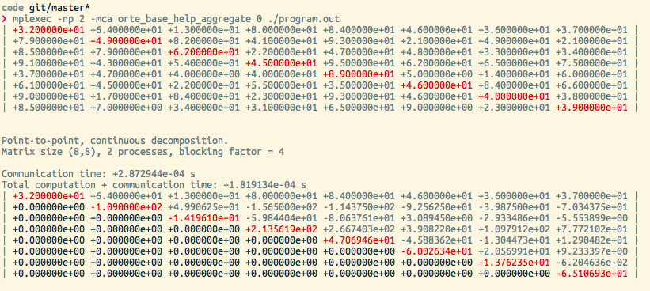
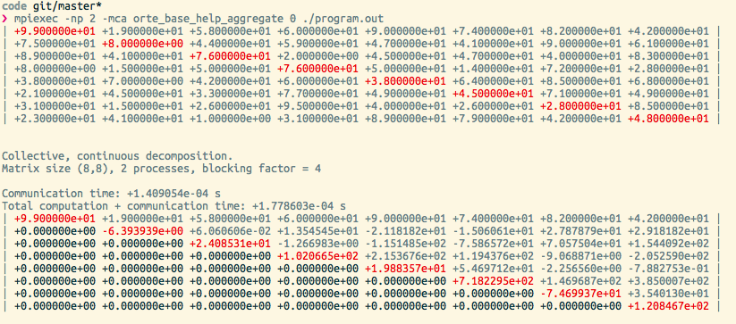

**Ryan Ordille** (260399372)

ryan.ordille@mail.mcgill.ca

ECSE 420: Parallel Computing, Fall 2014

Lab 2 - 07 November, 2014

# Setup

Apple MacBook Air, 13", Mid 2011 (model 4,2)

**Operating System**: OS X 10.10 Yosemite

**Processor**: 1.7 GHz Intel Core i5, 2 cores, 256 KB L2 cache per core, 3 MB L3 cache

**Other Information**: 4 GB 1333 MHz DDR3 RAM, Intel HD Graphics 3000 384 MB, SSD drive

Using `open-mpi-1.8.3`

# 1. Gaussian Elimination

## 1.1 Parallelization Strategy

## 1.2 Serial Implementation

See `GESerial.c`.

### Results

Serial implementation output:


Serial implementation timing:


    [Serial] (1024x1024) 1.834153e+00 s
    [Serial] (2048x2048) 1.491354e+01 s
    [Serial] (4096x4096) 1.204770e+02 s

# 2. Message Passing Program

## 2.1 Point-to-Point

See `GEmpi.c`, function `gauss_elim_parallel_p2p()`.



## 2.2 Broadcast/Collective

See `GEmpi.c`, function `gauss_elim_parallel_bcast()`.



# 3. Experiment

## 3.2 Output data

Note: Real = Total / NumProcesses

### n=1024, np=02


```
Point-to-Point, continuous decomposition.
Matrix size (1024,1024), 2 processes, blocking factor = 512
Communication time: +2.496624e-01 s
Computation time: +2.284000e+00 s
Total computation + communication time: +2.533662e+00 s

Point-to-Point, circular decomposition.
Matrix size (1024,1024), 2 processes, blocking factor = 512
Communication time: +5.734062e-02 s
Computation time: +2.077748e+00 s
Total computation + communication time: +2.135089e+00 s

Collective, continuous decomposition.
Matrix size (1024,1024), 2 processes, blocking factor = 512
Communication time: +2.817822e-02 s
Computation time: +2.372027e+00 s
Total computation + communication time: +2.400205e+00 s

Collective, circular decomposition.
Matrix size (1024,1024), 2 processes, blocking factor = 512
Communication time: +2.761292e-02 s
Computation time: +1.869801e+00 s
Total computation + communication time: +1.897414e+00 s
`

### n=1024, np=04


```
Point-to-Point, continuous decomposition.
Matrix size (1024,1024), 4 processes, blocking factor = 256
Communication time: +1.403330e+00 s
Computation time: +3.465884e+00 s
Total computation + communication time: +4.869214e+00 s

Point-to-Point, circular decomposition.
Matrix size (1024,1024), 4 processes, blocking factor = 256
Communication time: +4.776108e-01 s
Computation time: +3.359475e+00 s
Total computation + communication time: +3.837086e+00 s

Collective, continuous decomposition.
Matrix size (1024,1024), 4 processes, blocking factor = 256
Communication time: +2.944329e-01 s
Computation time: +4.774913e+00 s
Total computation + communication time: +5.069346e+00 s

Collective, circular decomposition.
Matrix size (1024,1024), 4 processes, blocking factor = 256
Communication time: +2.272630e-01 s
Computation time: +3.614222e+00 s
Total computation + communication time: +3.841485e+00 s
```

### n=1024, np=08


```
Point-to-Point, continuous decomposition.
Matrix size (1024,1024), 8 processes, blocking factor = 128
Communication time: +2.977805e+02 s
Computation time: +4.894713e+01 s
Total computation + communication time: +3.467276e+02 s

Point-to-Point, circular decomposition.
Matrix size (1024,1024), 8 processes, blocking factor = 128
Communication time: +2.579853e+02 s
Computation time: +1.079681e+02 s
Total computation + communication time: +3.659534e+02 s

Collective, continuous decomposition.
Matrix size (1024,1024), 8 processes, blocking factor = 128
Communication time: +4.691582e+02 s
Computation time: +1.642646e+02 s
Total computation + communication time: +6.334228e+02 s

Collective, circular decomposition.
Matrix size (1024,1024), 8 processes, blocking factor = 128
Communication time: +3.867439e+02 s
Computation time: +1.480555e+02 s
Total computation + communication time: +5.347994e+02 s
```

### n=1024, np=16


```
Point-to-Point, continuous decomposition.
Matrix size (1024,1024), 16 processes, blocking factor = 64
Summed Communication time: +5.832155e+03 s
Real Communication time: +3.645097e+02 s
Summed Computation time: +4.296388e+02 s
Real Computation time: +0.000000e+00 s
Total computation + communication time: +6.261793e+03 s
Real computation + communication time: +3.913621e+02 s

Point-to-Point, circular decomposition.
Matrix size (1024,1024), 16 processes, blocking factor = 64
Summed Communication time: +4.951117e+03 s
Real Communication time: +3.094448e+02 s
Summed Computation time: +9.157714e+02 s
Real Computation time: +0.000000e+00 s
Total computation + communication time: +5.866888e+03 s
Real computation + communication time: +3.666805e+02 s

Collective, continuous decomposition.
Matrix size (1024,1024), 16 processes, blocking factor = 64
Summed Communication time: +4.301902e+03 s
Real Communication time: +2.688688e+02 s
Summed Computation time: +1.300491e+03 s
Real Computation time: +0.000000e+00 s
Total computation + communication time: +5.602393e+03 s
Real computation + communication time: +3.501496e+02 s

Collective, circular decomposition.
Matrix size (1024,1024), 16 processes, blocking factor = 64
Summed Communication time: +3.811492e+03 s
Real Communication time: +2.382182e+02 s
Summed Computation time: +1.314876e+03 s
Real Computation time: +0.000000e+00 s
Total computation + communication time: +5.126367e+03 s
Real computation + communication time: +3.203980e+02 s
```

### n=2048, np=02


```
Point-to-Point, continuous decomposition.
Matrix size (2048,2048), 2 processes, blocking factor = 1024
Communication time: +1.916867e+00 s
Computation time: +1.797140e+01 s
Total computation + communication time: +1.988827e+01 s

Point-to-Point, circular decomposition.
Matrix size (2048,2048), 2 processes, blocking factor = 1024
Communication time: +1.101716e-01 s
Computation time: +1.405899e+01 s
Total computation + communication time: +1.416916e+01 s

Collective, continuous decomposition.
Matrix size (2048,2048), 2 processes, blocking factor = 1024
Communication time: +1.749251e-01 s
Computation time: +2.032325e+01 s
Total computation + communication time: +2.049817e+01 s

Collective, circular decomposition.
Matrix size (2048,2048), 2 processes, blocking factor = 1024
Communication time: +1.416628e-01 s
Computation time: +1.790520e+01 s
Total computation + communication time: +1.804687e+01 s
```

### n=2048, np=04


```
Point-to-Point, continuous decomposition.
Matrix size (2048,2048), 4 processes, blocking factor = 512
Communication time: +1.128113e+01 s
Computation time: +2.979890e+01 s
Total computation + communication time: +4.108003e+01 s

Point-to-Point, circular decomposition.
Matrix size (2048,2048), 4 processes, blocking factor = 512
Communication time: +4.319773e+00 s
Computation time: +2.844327e+01 s
Total computation + communication time: +3.276305e+01 s

Collective, continuous decomposition.
Matrix size (2048,2048), 4 processes, blocking factor = 512
Communication time: +5.928186e+00 s
Computation time: +5.755853e+01 s
Total computation + communication time: +6.348672e+01 s

Collective, circular decomposition.
Matrix size (2048,2048), 4 processes, blocking factor = 512
Communication time: +2.087896e+00 s
Computation time: +3.973988e+01 s
Total computation + communication time: +4.182778e+01 s
```

### n=2048, np=08


### n=2048, np=16


### n=4096, np=02


```
Point-to-Point, continuous decomposition.
Matrix size (4096,4096), 2 processes, blocking factor = 2048
Communication time: +1.777081e+01 s
Computation time: +1.776045e+02 s
Total computation + communication time: +1.953753e+02 s

Point-to-Point, circular decomposition.
Matrix size (4096,4096), 2 processes, blocking factor = 2048
Communication time: +1.640594e+00 s
Computation time: +1.487402e+02 s
Total computation + communication time: +1.503808e+02 s

Collective, continuous decomposition.
Matrix size (4096,4096), 2 processes, blocking factor = 2048
Communication time: +8.259988e-01 s
Computation time: +1.891440e+02 s
Total computation + communication time: +1.899700e+02 s

Collective, circular decomposition.
Matrix size (4096,4096), 2 processes, blocking factor = 2048
Communication time: +5.134349e-01 s
Computation time: +1.373282e+02 s
Total computation + communication time: +1.378416e+02 s
```

### n=4096, np=04


```
Point-to-Point, continuous decomposition.
Matrix size (4096,4096), 4 processes, blocking factor = 1024
Communication time: +8.191289e+01 s
Computation time: +2.832972e+02 s
Total computation + communication time: +3.652101e+02 s

Point-to-Point, circular decomposition.
Matrix size (4096,4096), 4 processes, blocking factor = 1024
Communication time: +1.559738e+01 s
Computation time: +2.535356e+02 s
Total computation + communication time: +2.691330e+02 s

Collective, continuous decomposition.
Matrix size (4096,4096), 4 processes, blocking factor = 1024
Communication time: +8.857163e+00 s
Computation time: +3.487060e+02 s
Total computation + communication time: +3.575632e+02 s

Collective, circular decomposition.
Matrix size (4096,4096), 4 processes, blocking factor = 1024
Communication time: +8.012309e+00 s
Computation time: +2.489533e+02 s
Total computation + communication time: +2.569656e+02 s
```

### n=4096, np=08


```
Point-to-Point, continuous decomposition.
Matrix size (4096,4096), 8 processes, blocking factor = 512
Summed Communication time: +1.765698e+03 s
Real Communication time: +2.207123e+02 s
Summed Computation time: +6.559446e+02 s
Real Computation time: +0.000000e+00 s
Total computation + communication time: +2.421643e+03 s
Real computation + communication time: +3.027053e+02 s

Point-to-Point, circular decomposition.
Matrix size (4096,4096), 8 processes, blocking factor = 512
Summed Communication time: +1.622032e+03 s
Real Communication time: +2.027541e+02 s
Summed Computation time: +9.439638e+02 s
Real Computation time: +0.000000e+00 s
Total computation + communication time: +2.565996e+03 s
Real computation + communication time: +3.207495e+02 s

Collective, continuous decomposition.
Matrix size (4096,4096), 8 processes, blocking factor = 512
Communication time: +2.143033e+03 s
Computation time: +1.138506e+03 s
Total computation + communication time: +3.281539e+03 s

Collective, circular decomposition.
Matrix size (4096,4096), 8 processes, blocking factor = 512
Communication time: +1.842639e+03 s
Computation time: +1.105007e+03 s
Total computation + communication time: +2.947646e+03 s
```

### n=4096, np=16


